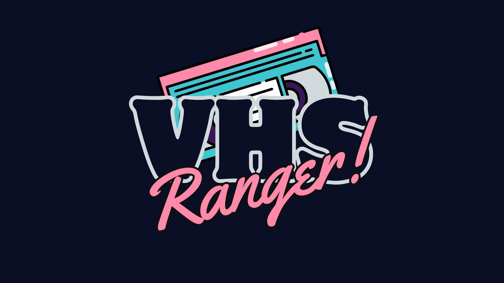

<p align="center">
  
</p>

<p align="center">
  A modern, self-hostable collection manager for VHS tape enthusiasts.
</p>

<p align="center">
  
  
  
  <a href="https://github.com/xXJimnyCricketXx/VHSRanger/actions/workflows/docker-publish.yml">
    
  </a>
</p>

## Overview

VHSRanger! allows you to keep track of your VHS tape collection. It uses the TMDb API to retrieve metadata, covers and cast information for your collection, providing a convenient and fully customizable dashboard for your home server. Each tape can be flagged as an **original** retail release or a **home recording**, and only originals carry a value estimate.

## Contents

- [Features](#features)
- [Quick Start (Docker Compose)](#quick-start-docker-compose)
- [Unraid](#unraid)
- [Configuration](#configuration)
- [Tech Stack](#tech-stack)
- [Documentation](#documentation)
- [License](#license)

## Features

- **Smart Import** — Add tapes by searching TMDb, scanning a barcode, or entering them manually.
- **Duplicate Detection** — Flags matching entries when adding a tape you may already own, letting you bump the quantity instead of creating a duplicate.
- **Original vs. Home Recording** — Every tape is flagged as an original retail release or a self-recorded copy; value estimates only apply to originals.
- **Advanced Organization** — Track the physical shelf location of every tape and its condition.
- **Statistics** — Dedicated statistics page (genre distribution, condition, value trends, top valuable tapes, and more) plus modular dashboard widgets.
- **Wishlist** — Keep track of future finds and move them into your collection once received.
- **Print / PDF Export** — Export your collection or wishlist as a printable list.
- **Secure Access** — Authentication with IP blocking, plus visibility controls to hide specific tapes, genres, or types from guests.
- **Backups** — Manual and scheduled automatic database backups, with restore support.
- **Color Themes** — Several built-in visual themes, including light and dark mode.
- **Multilingual** — Fully localized in English 🇬🇧, French 🇫🇷, German 🇩🇪, Spanish 🇪🇸 and Italian 🇮🇹.

## Quick Start (Docker Compose)

```bash
git clone https://github.com/xXJimnyCricketXx/VHSRanger.git
cd VHSRanger
cp .env.example .env
# edit .env and set at least PASSJWT and SESSION_SECRET (see Configuration below)
docker compose up -d
```

The app is then available at `http://localhost:18003`. See the [Docker Deployment Guide](./docs/docker.md) for the pre-built image option and troubleshooting.

## Unraid

A ready-made template is available at [`unraid-template/vhsranger.xml`](unraid-template/vhsranger.xml). In Unraid, go to **Docker → Add Container**, paste the raw GitHub URL of that file into the **Template** field, and port, paths, and variables will be pre-filled. See the [Docker Deployment Guide](./docs/docker.md#option-3-unraid) for details.

## Configuration

| Variable | Required | Description |
|---|---|---|
| `MONGODB_URL` | yes | Connection string for your MongoDB instance |
| `PASSJWT` | yes | Complex password used for JWT token encryption |
| `SESSION_SECRET` | yes | Complex secret used for session encryption |
| `PROD` | no | Set to `true` **only** if serving over HTTPS via a reverse proxy; otherwise leave `false` |
| `VHS_PORT` | no | Port the app listens on inside the container (default: `3098`) |
| `BASE_URL` | no | Base path for serving on a sub-path, leave empty to serve from root |
| `TMDB_API_KEY` | no | TMDb API key — the app works without it, but metadata lookup won't. See [API Configuration](./docs/api-keys.md) |
| `EBAY_APP_ID` / `EBAY_CERT_ID` | no | eBay Browse API production credentials — enables the "estimate price" button on the detail page (rough estimate from active listings). Get free keys at [developer.ebay.com](https://developer.ebay.com) |

## Tech Stack

| Component | Technology |
|---|---|
| Backend | Node.js / Express |
| Database | MongoDB |
| Frontend | EJS Templates |
| Styling | Tailwind CSS |
| Localization | i18next |
| API | TMDb |

## Documentation

- 🏁 [**Getting Started**](./docs/getting-started.md) - Manual installation and requirements.
- 🐳 [**Docker Deployment**](./docs/docker.md) - Docker Compose, pre-built image, and Unraid.
- 🔑 [**API Configuration**](./docs/api-keys.md) - How to obtain your TMDb API key.

## License

Distributed under the MIT License. See [`LICENSE`](./LICENSE) for more information.
